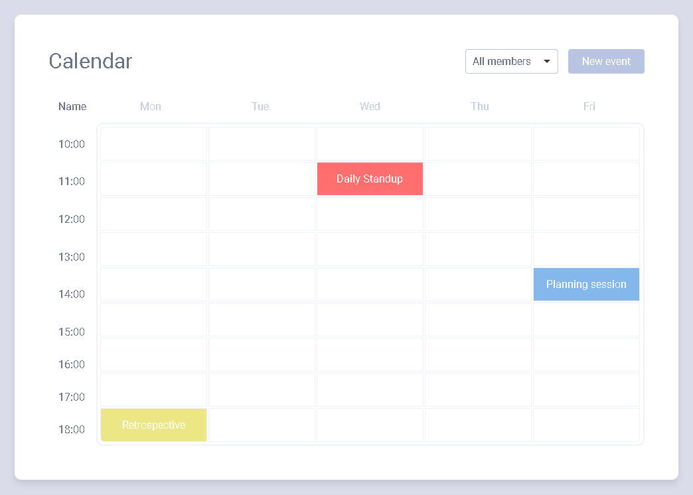

# Calendar app

Simple meeting planning calendar for a meeting room in your office.



## Quick start

```
# Download repository:
git clone https://github.com/evgenii-del/calendar-app.git

# Go to the app:
cd calendar-app

# Install dependencies:
npm install

# Server with live reload at http://localhost:3000/
npm run start
```

## Production build

```
# Output will be at app/ folder
npm run build
```

## The project used technologies such as:

* Webpack 5
* Babel
* ESlint
* devServer
* Scss

## The project has implemented:

* Display meetings planned;
* Filter meetings for a particular team member;
* Add new meetings;
* Delete meetings;
